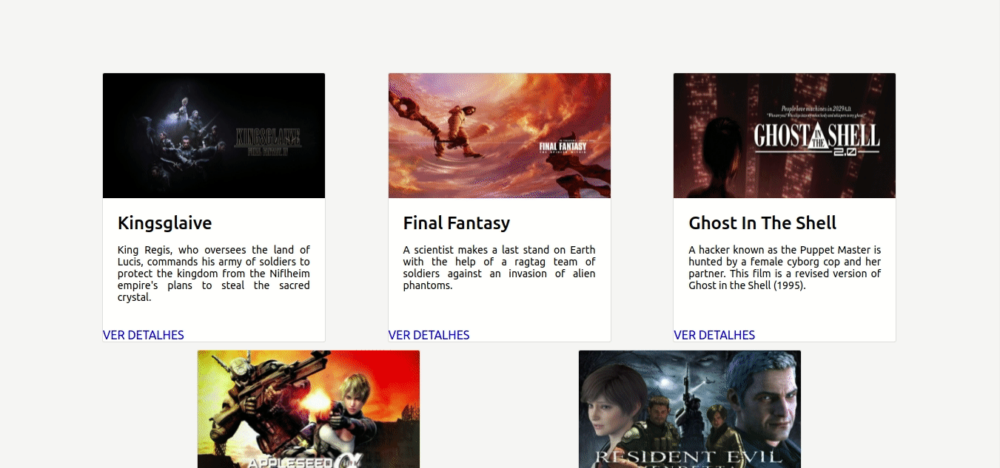

# Movie Cards Library CRUD

# Contexto
Este projeto trata-se de uma continuação dos projetos Movie Cards Library e Movie Cards Library Stateful, onde será criado um **CRUD** de cartões de filmes em React.

A sigla **CRUD** significa, _Create, Read, Update and Delete_, então deve ser possível realizar as seguintes operações nesse projeto:

  

- Adicionar um novo filme à lista - **CREATE**;

- Listar todos os filmes cadastrados, com uma página de informações resumidas sobre cada filme e uma página de informações detalhadas de um filme selecionado - **READ**;

- Editar um filme da lista - **UPDATE**;

- E apagar um filme da lista - **DELETE**;


Segue abaixo um GIF da aplicação.

  




## Técnologias usadas

Front-end:
> Desenvolvido usando: React.


## Instalando Dependências
``` 
> Frontend
cd movie-cards-library-crud/
npm install
``` 
## Executando aplicação

* Para rodar o front-end:

  ```
    npm start
  ```

